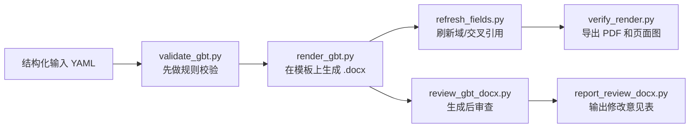

# GB/T 标准文稿 Docx Skill

面向中文标准文稿的 Word skill。

它的目标不是“凭空拼一个 `.docx`”，而是基于现有标准模板，完成结构化生成、输入校验、生成后审查，以及修改意见表输出，尽量把 `GB/T 1.1—2020` 的体例约束前移到流程里。

当前仓库重点覆盖：

- `GB/T 1.1—2020` 标准文稿生成、校验、审查
- 国家标准模板和行业标准模板两类 profile
- `GB/T 1.2` 采标场景的第一版基础检查

## 这个 skill 适合做什么

- 根据结构化 YAML 输入生成标准草案 `.docx`
- 在渲染前检查封面字段、章节结构、书签、交叉引用、附录连续性
- 对生成后的 `.docx` 做规则审查，并导出 JSON 结果
- 把审查结果整理成“修改意见表” Word 文档
- 对规范性引用文件做版本核验提示，区分哪些条目必须单独查新

## 核心思路

和很多“从零造 Word”的方案不同，这个仓库默认把模板当成真源：

- 模板决定版式、样式、页眉页脚、目录域和已有占位结构
- 输入文件决定封面信息、正文结构、图表内容、附录和引用关系
- 规则文件负责约束“哪些内容应该怎么写”，而不是把规则硬编码在每个脚本里



## 文稿元素支持到什么程度

这个 skill 当前已经能比较稳定地处理下列元素：

| 类别 | 当前支持 |
| --- | --- |
| 封面 | ICS、CCS、标准号、中文名、英文名、发布日期、实施日期、备案号、归口/发布信息 |
| 前置部分 | 前言、引言、目录页 |
| 正文结构 | 范围、规范性引用文件、术语和定义、缩略语、主条款、子条款 |
| 文档块 | 普通段落、图、表、注、示例 |
| 附录 | 资料性/规范性附录、附录下条款树 |
| 引用关系 | `REF/PAGEREF` 交叉引用、显式书签、自动生成稳定引用名 |
| 审查输出 | JSON 审查结果、修改意见表 `.docx` |

你可以把它理解成：它已经能覆盖“标准草案首版生成 + 一轮格式/规则审查”的主链路，但还不是一个把 Word 全部复杂对象都自动化完毕的系统。

## 一个最小输入长什么样

仓库里放了公开最小示例：[`examples/gbt-minimal.yaml`](examples/gbt-minimal.yaml)。

它描述的是“写什么”，不是“Word 里每个样式怎么点出来”。例如：

```yaml
cover:
  standard_number: GB/T 12345—2026
  title_zh: 标准文稿生成系统要求
  title_en: Requirements for standard document generation systems

foreword:
  - 本文件按照 GB/T 1.1—2020 给出的规则起草。

sections:
  scope:
    - 本文件规定了标准文稿生成系统的输入、输出、模板管理和校验要求。

clauses:
  - title: 生成要求
    children:
      - title: 模板选择
        paragraphs:
          - 系统应基于模板 profile 选择国家标准模板或行业标准模板。
```

也就是说，调用者主要关心：

1. 这份标准有哪些组成部分。
2. 每个部分的文本是什么。
3. 图、表、注、示例、附录和引用关系怎么挂上去。

至于最终样式，优先交给模板和 profile。

## 典型工作流

### 1. 生成标准草案

```bash
python3 scripts/validate_gbt.py \
  --input examples/gbt-minimal.yaml \
  --rules profiles/gbt/rules.yaml

python3 scripts/render_gbt.py \
  --input examples/gbt-minimal.yaml \
  --template templates/gbt/source/国家标准.dotx \
  --output outputs/generated/示例标准.docx
```

### 2. 刷新域并做视觉核验

```bash
python3 scripts/refresh_fields.py \
  --input outputs/generated/示例标准.docx \
  --soffice-roundtrip

python3 scripts/verify_render.py \
  --input outputs/generated/示例标准.docx \
  --output-dir outputs/verify/national
```

### 3. 生成后审查并输出修改意见表

```bash
python3 scripts/review_gbt_docx.py \
  --input outputs/generated/示例标准.docx \
  --output outputs/review/示例标准.review.json

python3 scripts/report_review_docx.py \
  --input outputs/review/示例标准.review.json \
  --output outputs/review/示例标准-修改意见表.docx
```

### 4. 规范性引用文件版本核验

```bash
python3 scripts/check_normative_refs.py \
  --input examples/gbt-minimal.yaml \
  --output outputs/review/示例标准.normative-refs.json
```

这个步骤的职责是“提示你哪里必须核验”，不是擅自把引用标准替换成最新版。

## 当前能力边界

第一版已经支持：

- 基于 `.dotx` 模板定点填充，而不是重建整套 Word 样式
- 国家标准和行业标准模板适配
- 模板内容控件、表单域和常见占位文本替换
- 目录域、书签、`REF/PAGEREF` 交叉引用的基础处理
- 图题、表题、术语条、主条款、附录条款的稳定引用名生成
- 生成后直接读取 OOXML 做规则审查
- `GB/T 1.2` 采标场景的基础一致性检查

第一版暂不覆盖：

- 复杂图表对象的自动插入
- 所有复杂交叉引用的完全重算
- 更深层级附录条款的全面编排
- 可公开分发的模板真源

## 目录结构

- `SKILL.md`
  skill 入口说明
- `scripts/`
  生成、校验、审查、报告脚本
- `profiles/gbt/`
  输入 schema、规则和样式映射
- `templates/gbt/profiles/`
  模板 profile
- `templates/gbt/assets/`
  可公开静态资源
- `knowledge/gbt_1_1/`
  `GB/T 1.1` 规则知识层
- `knowledge/gbt_1_2/`
  采标规则骨架
- `examples/`
  可公开最小示例
- `docs/`
  架构、边界和路线图文档

## 安装

```bash
python3 -m pip install -r requirements.txt
```

依赖比较轻，核心是：

- `python-docx`
- `PyYAML`

如果要做域刷新和版式回写，还需要本机可用的 `LibreOffice`。

## 公开仓库默认不包含什么

为避免把实验数据和可能存在授权边界的内容一起公开，仓库默认不提交：

- `outputs/`、`tmp/` 下的生成物和中间产物
- 项目级实验数据
- 原始标准全文和长篇抽取文本
- `templates/gbt/source/` 下的模板真源

这意味着公开仓库更像“可复用 skill 本体”，而不是某个真实标准项目的完整工作目录。

## 进一步说明

- 架构说明：[`docs/architecture.md`](docs/architecture.md)
- 公开边界：[`docs/public-repo.md`](docs/public-repo.md)
- `GB/T 1.2` 采标补充：[`docs/gbt-1.2-adoption.md`](docs/gbt-1.2-adoption.md)
- 规范性引用文件核验：[`docs/normative-reference-verification.md`](docs/normative-reference-verification.md)
- 路线图：[`docs/roadmap.md`](docs/roadmap.md)
